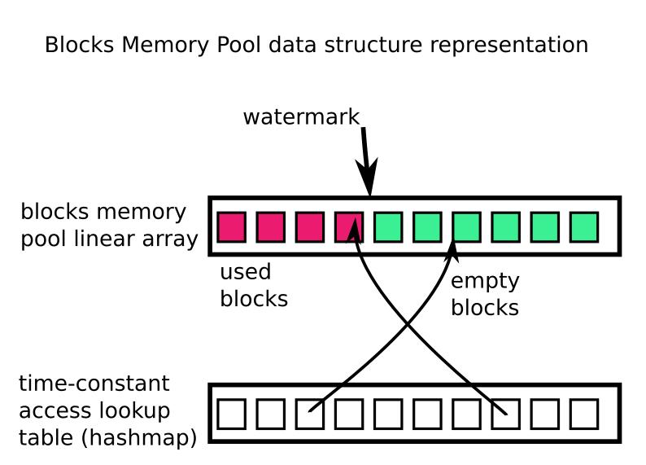

# Domulo VDOM internals

Beyond the scene, Domulo uses a Block Memory Pool, a structure intended to minimize the garbage collection cycles. This technique is directly derivated from the video games world.

The Blocks Memory Pool (BMP) is a combination of:

* a list of contiguous blocks, with a same signature. From index 0 to 'watermark' are used blocks, and the end of the list live empty (recycled) blocks. Each block is identified by a alhpanumeric UID;

* an object hashmap (lookup table) which maps blocks UIDs to indices in the list, alowing time-constant access for blocks.

## alphanumeric keys

The blocks UIDs a 4-digits strings; characters are taken from the ranges /A-Za-z0-9/ plus '_' and '$' and they are produced by a Multiply-With-Carry (MWC= pseudo random number generator (PRNG). It can produce 64 * 64 * 64 * 64 ~ 16.7M different values covering a large variey of applications

## Data block structure

Each block is similar to others, the generic block signature is:

    type DataBlock = {
      uid: string,
      sort: string
      // other metadata and data fieldss...
    }

For VDOM applications, a typivc block signature is :

    type DataBlock = {
      uid: string,

      // 'EMPTY', 'ELEMENT', 'ATTR', 'TEXT', 'CODE' ...
      sort: string,

      // parent block UID
      puid: string,

      // next sibling block UID
      next: string,

      // first children block UID
      nodes: string,

      // foirst attr block UID
      attrs: string,

      // data field name
      name: string,

      // data value  filed
      value: string            
    }
